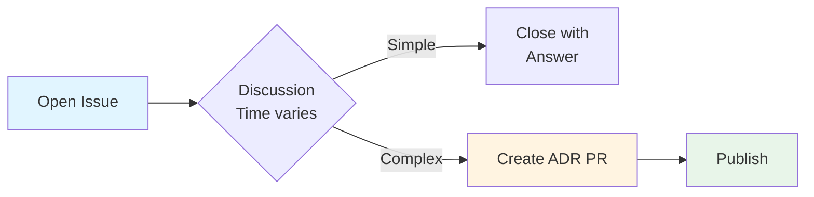

# 3. Use Single-Process Approach for Architecture Requests

Date: 2025-11-26

## Status

Accepted

## Context

Architecture governance can use tiered processes (Quick Reviews → ADRs → RFCs) where requesters must choose the appropriate tier. However, this creates:

- Cognitive overhead: "Which tier is this?"
- Procedural confusion about process selection
- Need to migrate requests between tiers
- Higher barrier to asking questions

We want to encourage early engagement before problems become expensive.

## Decision

Use a **single unified process** where formality emerges naturally from impact.

**Process:**

**Key insight:** Same process, different discussion length based on natural impact.

**Label:** `architecture-question`

**Optional:** `high-impact`, `urgent`

## Rationale

**Single process eliminates confusion:**

- No tier selection needed
- No migrations between systems
- Natural scaling based on impact

**Formality emerges from context:**

| Impact | Discussion | Outcome         |
| ------ | ---------- | --------------- |
| Low    | 3-5 days   | Answer in issue |
| Medium | 1-2 weeks  | Likely ADR      |
| High   | 2-4 weeks  | Definitely ADR  |

**"Question" lowers barrier:**

- Less intimidating than "decision"
- Encourages early consultation
- Welcomes exploratory discussion

## Consequences

**Positive:**

- Simple for requesters
- Lower barrier to engagement
- Fast for simple questions
- Still rigorous for important decisions
- Everything transparent (issues + ADRs)

**Negative:**

- Less formal than traditional governance
- Board must identify when to create ADR

**Implementation:**

- Issue template: `architecture-question`
- Process docs emphasize "ask early, ask often"
- ADRs for precedent-setting decisions only

## Alternatives Considered

**Three-tier system:** Clear separation but high cognitive overhead

**ADR-only:** Everything documented but too slow for simple questions

**RFC-heavy:** Very formal but overkill for our multi-project context

## References

- [OME-NGFF RFC Process](https://ngff.openmicroscopy.org)
- [ADR GitHub Repository](https://adr.github.io/)
