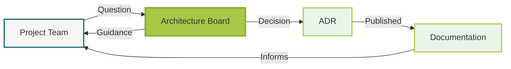

# SciLifeLab Architecture Board

> Ensuring interoperable, sustainable, and FAIR infrastructure across SciLifeLab's federated platforms.

The Architecture Board provides technical governance and guidance for SciLifeLab infrastructure, enabling seamless collaboration while respecting platform autonomy. We support decision-making for technical architecture across all SciLifeLab platforms and services.

!!! question "Need Architecture Help?"

    - No question too small
    - Response within 2 weeks
    - Early guidance prevents expensive mistakes

    [:octicons-issue-opened-16: Open an Issue](https://github.com/SciLifeLab/architecture/issues/new?template=architecture-question.md){ .md-button .md-button--primary }
    [:octicons-comment-discussion-16: Start a Discussion](https://github.com/SciLifeLab/architecture/discussions){ .md-button }
    [:octicons-mail-16: architecture@scilifelab.se](mailto:architecture@scilifelab.se){ .md-button }

## What We Do

### :material-compass: Architecture Guidance

Best practices for technical design, integration patterns, and technology choices.

### :material-file-document-edit: Decision Records

Transparent documentation of all significant architectural decisions (ADRs).

### :material-connection: Cross-Platform Coordination

Facilitate collaboration to ensure coherent architecture across SciLifeLab.

## Recent Decisions

| Decision                                                                                            | Status   | Summary                                    |
| --------------------------------------------------------------------------------------------------- | -------- | ------------------------------------------ |
| [ADR-0004: MkDocs Material](decisions/0004-use-mkdocs-material-for-documentation-site.md)           | Accepted | Use MkDocs Material for documentation site |
| [ADR-0003: Single Process](decisions/0003-use-single-process-approach-for-architecture-requests.md) | Accepted | Single process for architecture requests   |
| [ADR-0002: CC BY-SA 4.0](decisions/0002-use-cc-by-sa-4-0-license.md)                                | Accepted | Use CC BY-SA 4.0 license for content       |
| [ADR-0001: Record Decisions](decisions/0001-record-architecture-decisions.md)                       | Accepted | Record architecture decisions as ADRs      |

## Board Members

| Name              | Affiliation | Role                                                                                                                 |
| ----------------- | ----------- | -------------------------------------------------------------------------------------------------------------------- |
| Jonas Hagberg     | NBIS        | Chair, [Certified IT Architect](https://app.diplomasafe.com/sv-SE/diploma/d2e66e08f42702140adfb61a0fb2315ef6d93ccb8) |
| Johan Viklund     | NBIS        | Technical Expert                                                                                                     |
| Jonas Söderberg   | NBIS SCoRe  | Technical Expert                                                                                                     |
| Johannes Alneberg | NGI         | Technical Expert                                                                                                     |
| Jonas Windhager   | NBIS-BIIF   | Technical Expert                                                                                                     |

_Adjunct members: Björn Nystedt, Hanna Kultima (IDS PMT)_

## Get Involved

The Architecture Board welcomes input from all SciLifeLab teams and the broader community. Whether you have a technical proposal, an architecture concern, or need guidance on a decision, we're here to help.

!!! tip "How to Contribute"

    1. **Not sure yet?** Start a [GitHub Discussion](https://github.com/scilifelab/architecture/discussions) or email [architecture@scilifelab.se](mailto:architecture@scilifelab.se)
    2. **Have a question?** Open a [GitHub Issue](https://github.com/scilifelab/architecture/issues) to get guidance
    3. **Proposing a change?** Create an ADR following our [template](decisions/0001-record-architecture-decisions.md)
    4. **Found an issue?** Submit a pull request with your suggested improvements

---

Part of [SciLifeLab](https://scilifelab.se) – Sweden's national infrastructure for life sciences research.

**Please cite as:**
SciLifeLab Architecture Board. (2025). _SciLifeLab Architecture Governance._ GitHub repository: <https://github.com/SciLifeLab/architecture>
